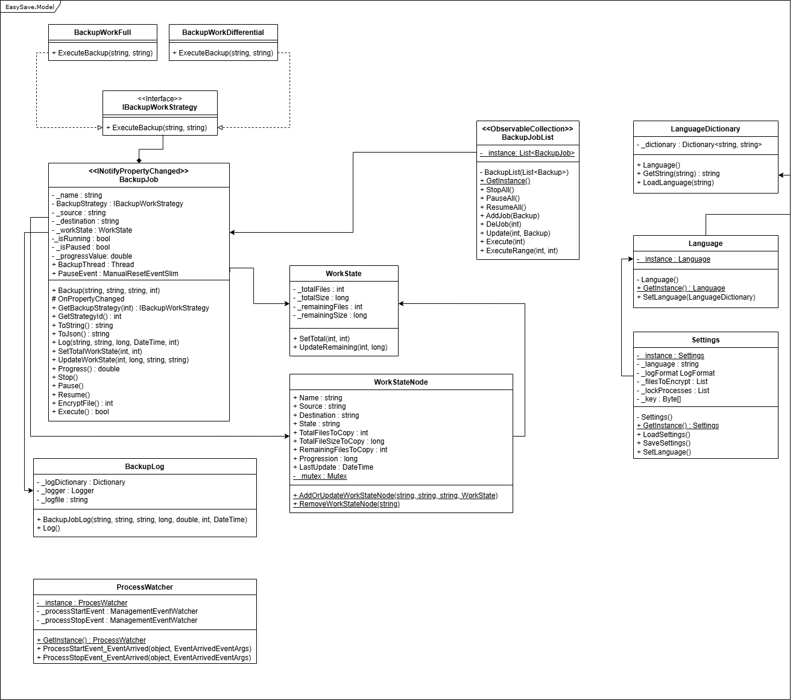

<!-- PROJECT SHIELDS -->
<!--
*** I'm using markdown "reference style" links for readability.
*** Reference links are enclosed in brackets [ ] instead of parentheses ( ).
*** See the bottom of this document for the declaration of the reference variables
*** for contributors-url, forks-url, etc. This is an optional, concise syntax you may use.
*** https://www.markdownguide.org/basic-syntax/#reference-style-links
-->
[![Contributors][contributors-shield]][contributors-url]
[![Forks][forks-shield]][forks-url]
[![Stargazers][stars-shield]][stars-url]
[![Issues][issues-shield]][issues-url]
[![Unlicense License][license-shield]][license-url]
[![LinkedIn][linkedin-shield]][linkedin-url]
 

  

  <h3 align="center">EasySave</h3>
  

    EasySave is a simple and easy to use backup software.
  

  <h3>
  Class diagram
  </h3>
  

<!-- MARKDOWN LINKS & IMAGES -->
<!-- https://www.markdownguide.org/basic-syntax/#reference-style-links -->
[contributors-shield]: https://img.shields.io/github/contributors/Raikuji/EasySave.svg?style=for-the-badge
[contributors-url]: https://github.com/Raikuji/EasySave/graphs/contributors
[forks-shield]: https://img.shields.io/github/forks/Raikuji/EasySave.svg?style=for-the-badge
[forks-url]: https://github.com/Raikuji/EasySave/network/members
[stars-shield]: https://img.shields.io/github/stars/Raikuji/EasySave.svg?style=for-the-badge
[stars-url]: https://github.com/Raikuji/EasySave/stargazers
[issues-shield]: https://img.shields.io/github/issues/Raikuji/EasySave.svg?style=for-the-badge
[issues-url]: https://github.com/Raikuji/EasySave/issues
[license-shield]: https://img.shields.io/github/license/Raikuji/EasySave?style=for-the-badge
[license-url]: https://github.com/Raikuji/EasySave/blob/master/LICENSE
[linkedin-shield]: https://img.shields.io/badge/-LinkedIn-black.svg?style=for-the-badge&logo=linkedin&colorB=555
[linkedin-url]: https://linkedin.com/in/antoine-gachenot-1921aa17b
